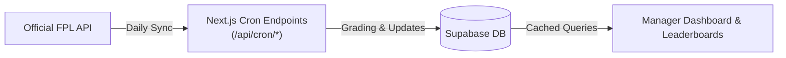

# Pro Pundit League

A companion web application and mini-game suite for Fantasy Premier League (FPL) managers. Built with Next.js App Router, Supabase, and Tailwind CSS, the platform introduces social prediction games, survivor tournaments, live leaderboard tracking, and automated sync with official Premier League data.

---

## Key Features & Game Modes

### Mini-Games & Prediction Modes
- **Fantastic Four (Survivor Tournament):** Pick 4 players or teams each gameweek with strict survivor elimination rules, win-streak tracking, and head-to-head competition.
- **Score Predictions:** Predict exact scorelines for selected Premier League fixtures (Super-6 style) with tiered point systems (exact score vs. correct result).
- **Team Predictions:** Forecast weekly starting lineups, formations, and captaincy picks before kickoff.
- **Bonus Prop Questions:** Weekly custom trivia questions and prop bets (for example, *"Will there be a red card in the North London Derby?"*) created by league administrators with automated scoring.
- **Manager Picks:** Select weekly top-performing managers and tactical choices.

### Social & Mini-Leagues
- **Custom Mini-Leagues:** Create and join private or public leagues using unique share codes or direct invite links (`/join/[code]`).
- **Live Leaderboards:** Overall multi-gameweek aggregated tables, single gameweek drill-downs, and survivor status indicators.
- **Fair Play & Transparency ("All Picks"):** Once a gameweek deadline passes, rivals' locked selections become transparent for public viewing.
- **Manager Profiles & Report Cards:** Badges, historical performance stats, and season performance metrics.
- **Fixture Difficulty Rating (FDR):** Built-in FDR visualizer to analyze upcoming fixture difficulty ratings.

### Notifications & PWA
- **Deadline Push Notifications:** Native browser Web Push notifications (powered by VAPID) alerting managers before gameweek deadlines.
- **Progressive Web App (PWA):** Installable on mobile and desktop devices.
- **Theme Support:** Dark and light modes with seamless switching.

---

## Architecture & Tech Stack

| Layer | Technology |
| :--- | :--- |
| **Framework** | [Next.js](https://nextjs.org/) (App Router, Server Actions, TypeScript) |
| **UI & Styling** | [React 19](https://react.dev/), [Tailwind CSS v4](https://tailwindcss.com/), [Framer Motion](https://www.framer.com/motion/), [Lucide React](https://lucide.dev/) |
| **Database & Auth** | [Supabase](https://supabase.com/) (PostgreSQL, Row-Level Security, Auth) |
| **External API** | Official Fantasy Premier League (FPL) REST API (`bootstrap-static`, `fixtures`) |
| **Push Notifications** | Web Push (`web-push` / VAPID) |
| **Hosting & Crons** | [Vercel](https://vercel.com/) & Vercel Cron Jobs |

---

## Automated Background Pipelines (Crons)

The application runs autonomously using Vercel Cron schedules defined in [`vercel.json`](./vercel.json):

| Schedule (UTC) | Endpoint | Description |
| :--- | :--- | :--- |
| `06:00` | `/api/cron/sync-static` | Syncs teams, active players, gameweek deadlines, and `is_current` status. Executes Auto-Admin to curate fixtures and unlock upcoming gameweeks. |
| `12:00` | `/api/cron/sync-fixtures` | Updates fixture schedules, postponements, and kickoff times. |
| `22:00` | `/api/cron/sync-results` | Fetches match results and live scores for completed games. |
| `03:00` | `/api/cron/calculate-scores` | Automatically evaluates predictions against final scores, computes bonus points, and updates league standings. |
| *On-demand / Cron* | `/api/cron/send-deadline-notifications` | Broadcasts push notifications ahead of gameweek transfer deadlines. |

---

## Admin Dashboard (`/admin`)

Users authenticated with the email matching `ADMIN_EMAIL` gain access to the dedicated administrative portal:
- **Gameweek Management:** Toggle gameweek availability for players and override deadlines.
- **Fixture Selection:** Manually curate or override featured fixtures for prediction modes.
- **Bonus Question Creator:** Create custom weekly trivia and grade the correct answers.
- **Score Overrides & Manual Grading:** Manually trigger scoring calculations or adjust edge-case points.
- **Data Export:** Export user selections and league entries to CSV or Excel spreadsheets.

---

## License

This project is licensed under the [MIT License](./LICENSE).